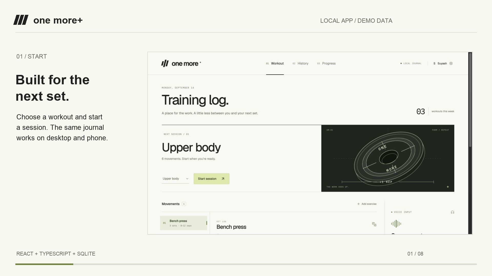

# One More

**Less typing. More lifting.** A responsive workout journal with optional voice integration, intentional corrections, and durable local storage.

Built for Suyash's project portfolio. The app is functional locally; ElevenLabs conversation is integrated but requires credentials and an agent configured with the included tool contract.

## Watch the demo

[**Watch the 70-second walkthrough**](https://suyashbwj.github.io/one-more/) · [Download MP4](docs/demo/one-more-demo.mp4) · [Verification notes](docs/verification.md)

[](https://suyashbwj.github.io/one-more/)

The public page hosts a captioned demo, not a shared live workout database. It uses actual app captures and demonstration data. Run the full app locally with the instructions below.

## Run locally

Requires Node.js 22.13+ and npm.

```sh
npm ci
npm run dev
```

Open **http://localhost:4317**. No external account is needed for manual logging, quick commands, history, progress, or export. Workouts persist in `data/one-more.sqlite`, independent of the browser.

```sh
npm test       # Domain, replay, restart, and command safety tests
npm run build # Type checking + production bundle
npm start     # Serve the production build
```

## The first workout

1. Choose Upper body, Lower body, or Pull day. Start the session.
2. Pick an exercise and log weight/reps. The rest timer starts automatically.
3. Try `135 lb for 8 reps` in the quick-log box, then confirm.
4. Try `Change set 2 to 7 reps`. Review the targeted correction before confirming.
5. Refresh. The active session and saved sets remain. The rest timer also resumes.
6. Finish the workout to unlock history and progress views.

An empty journal offers **Preferences → Load sample history** for exploring the charts. These records are visibly marked SAMPLE. Samples are included in displayed totals, so use an empty real journal for personal tracking.

## What is implemented

- Responsive desktop layout and phone navigation, with a horizontally scrolling exercise picker.
- Three starter templates and an exercise library. Extra exercises persist per template in this browser.
- Persistent active sessions, set logging, manual corrections, confirmed deletion, and completed-session history.
- Pounds/kilograms; unit switching converts the entered weight. Volume totals normalize to pounds. Zero-weight/bodyweight entries are supported.
- Rest timer with pause, resume, reset, and selectable duration. Stored deadlines survive refresh; no background timer precision assumption.
- A deterministic quick-command parser with confirmation. Wispr Flow can dictate into this field.
- ElevenLabs authenticated voice sessions, live-context client tools, and voice or on-screen confirmation.
- Weekly volume, lifetime totals, heaviest logged set per exercise, and JSON export.
- Keyboard-accessible dialogs, explicit empty/error states, and reduced-motion styling.

## Reliability decisions

The voice model cannot write directly to the database. The flow is:

`Speech → agent client tool → server parser → pending proposal → explicit confirmation → validated transaction → persisted result`

Each mutation includes a UUID request key. The server writes the change and its result into the same SQLite transaction. A network retry with the same key returns the original result. Reusing a key with a different payload is rejected. Two intentionally identical sets with different keys both count.

Corrections include an expected version. A stale edit receives a conflict instead of overwriting newer data. Edits and deletions retain before/after snapshots in an audit table. A database constraint permits only one active session. Finished sessions reject further set mutations; versioned session notes remain editable.

A failed request retains its request key in the current page for an exact retry. After a full page restart, the app reloads database truth; inspect the saved sets before retrying an uncertain operation. There is no offline mutation queue.

The parser deliberately supports a narrow numeric grammar, not arbitrary natural-language understanding. Missing set numbers, missing quantities, negative values, fractional reps, and conflicting units prompt clarification. Voice-agent prompting normalizes spoken numbers into digits before invoking the parser. Provider-side language interpretation still needs live testing.

## Voice setup

See [docs/elevenlabs-agent.md](docs/elevenlabs-agent.md) for the prompt, three client tools, credentials, and live verification steps.

The default UI makes the unconfigured state explicit. No fake transcript or simulated microphone is used. The browser gets a short-lived signed connection URL; the API key stays on the server. Voice sessions automatically stop after 60 seconds to help conserve the free allowance.

## Use on a phone

The web UI adapts to phone screens; this is a responsive web app, not a native iOS/Android build.

For a phone on the same trusted Wi-Fi network:

1. Stop the current server.
2. Run `npm run dev:lan`.
3. Open `http://YOUR_MAC_LAN_IP:4317` on the phone. Keep the Mac running.

Manual logging and history work over LAN HTTP. Microphone access generally requires HTTPS on a phone, so live voice needs a trusted HTTPS setup. The LAN mode is a single-user workspace without authentication; use it only on a trusted network. There is no public deployment or cloud sync in this version.

The manifest provides home-screen branding. Offline app caching is intentionally not implemented, so a home-screen shortcut still needs the local server.

## Project structure

- `src/App.tsx`: React UI, local preferences, command proposals, and voice integration.
- `src/style.css`: responsive design system and component styling.
- `server/index.ts`: Express API, signed voice URL broker, and Vite/static serving.
- `server/store.ts`: SQLite schema, transactional mutation engine, audit records, and sample fixtures.
- `server/commands.ts`: constrained command interpretation; never writes data.
- `tests/workouts.test.ts`: edge-case and recovery tests.

## Scope and portfolio accuracy

This version uses **SQLite**, not PostgreSQL. It preserves transactional guarantees while eliminating database setup for a local demo. Do not claim a PostgreSQL implementation on the résumé until that migration exists. Likewise, describe real ElevenLabs voice as verified only after the credentialed checklist passes.

Next production steps would be accounts and session ownership, PostgreSQL migrations, authenticated hosting, live voice evaluation with gym noise, and real-device microphone testing. This local version is not a multi-user service.

## Training tools (no API key required)

- **Previous session reference:** the last completed real workout for the selected movement, with every recorded set and a button to fill the next set's weight, reps, and unit. Reusing values never records an unperformed set. When the new session has more sets than the previous one, reuse falls back to the final previous set.
- **Exercise trends:** heaviest set, total volume, or total reps across the last 12 sessions. Mixed units normalize to pounds. Samples are excluded by default and may be explicitly included. Values are listed below the chart for accessibility; one-point and bodyweight histories are supported.
- **Searchable archive:** find workout names, exercises, or saved notes; filter real and sample sessions. Expand an entry to review sets and notes.
- **Session notes:** up to 2,000 characters, editable during or after a workout. Explicit Save notes writes to SQLite with idempotency and version checks. Unsaved drafts are recovered from browser storage across reloads and navigation when storage is available. Conflicts show the saved text and preserve the current draft for review.

Existing databases automatically receive the notes columns without replacing workouts. Notes are included in JSON exports. The workout's completed sets remain protected against mutation.
